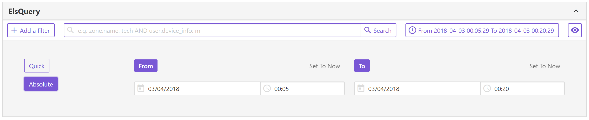
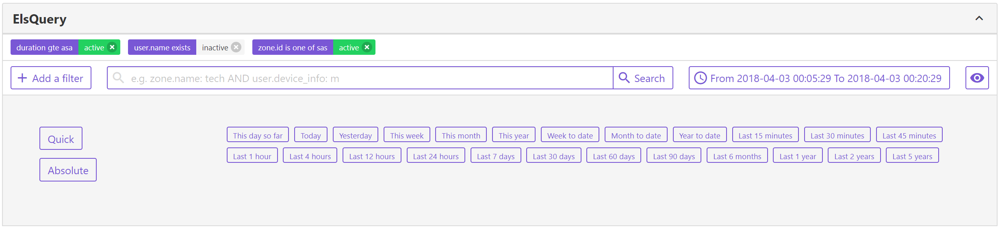

# ElsQuery

Elastic Search Query Builder Of Vuejs which is Like [Kibana Query Builder](https://demo.elastic.co/app/kibana#/dashboard/b7be4700-6837-11e7-bd1c-eb5e5ad48f8b). See also :

- [TimeRange](https://github.com/GopherJ/TimeRange)


## Demo




## Environment

- `vue 2.5.13`
- `buefy 0.6.6`


## Installation

```javascript
npm i -S els-query
```


## Usage

`main.js`
```javascript
import Vue from 'vue';
import Vuex from 'vuex';
import ElsQuery from 'ElsQuery';
import Buefy from 'buefy';
import 'buefy/lib/buefy.min.css';

Vue.use(Vuex);
Vue.use(Buefy);

const store = new Vuex.Store();

Vue.use(ElsQuery, {
  store
});
```

`index.html`
```html
<link rel="stylesheet" href="//cdn.materialdesignicons.com/2.0.46/css/materialdesignicons.min.css">
```

`template`
```vue
<els-query @change="(query) => yourMethod(query)" :update-interval="10000"></els-query>
```


## Features

- `Filters`
  - `ADD`
  - `EDIT`
  - `DELETE`
  - `DISABLE, ENABLE`

- `TimeRange`
  - `QUICK`
  - `ABSOLUTE`

- `QueryString`
  - `WILDCARD`

- `AutoRefresh`

## Options

- Props

|key|description|type|default|
|:---|---|---|---|
|`label`|`label of panel`|`String`|`ElsQuery`|
|`filterFactors`|`factors of elastic search`|`Array`|`[]`|
|`filterFields`|`fields of _source`|`Array`|`[{"duration":"duration"},{"user_id":"user.udid"},{"user_name":"user.name"},{"device_model":"user.device_info.model"},{"device_system":"user.device_info.system_name"},{"device_system_api":"user.device_info.system_api_id"},{"device_system_build":"user.device_info.system_build_number"},{"device_system_version":"user.device_info.system_version"},{"zone_id":"zone.id"},{"zone_name":"zone.name"},{"zone_tags":"zone.tags"},{"event_title":"event.title"},{"event_type":"event.type"},{"latitude":"location.lat"},{"longitude":"location.lon"}]`|
|`updateInterval`|`auto refresh interval`|`Number`|`1000`|

- Events

|name|description|arguments|
|:---|---|---|
|`change`|`query has changed, perhaps caused by filters, queryString, dateTimeStart, dateTimeEnd`|`(query)`|


## Example



```javascript
{
  "query": {
    "bool": {
      "must": [
        {
          "range": {
            "timestamp": {
              "gte": 1522739455974,
              "lte": 1522740355974,
              "format": "epoch_millis"
            }
          }
        },
        {
          "range": {
            "duration": {
              "gte": "asa"
            }
          }
        },
        {
          "bool": {
            "should": [
              {
                "match_phrase": {
                  "zone.id": "sas"
                }
              }
            ],
            "minimum_should_match": 1
          }
        }
      ],
      "must_not": [

      ]
    }
  }
}
```


## Store

`state`
```javascript
// TimeRange module
this.$store.state.TimeRange.dateTimeStart;
this.$store.state.TimeRange.dateTimeEnd;

// ElsQuery module
this.$store.state.ElsQuery.query;
```

`getters`
```
// recommend to deep clone this query so that you won't change the internal query
this.$store.getters['ElsQuery/GET_QUERY'];
```

`mutations`
```javascript
this.$store.commit('TimeRange/EDIT_DATE_TIME_START', new Date());
this.$store.commit('TimeRange/EDIT_DATE_TIME_END', new Date());
```


## License
MIT

